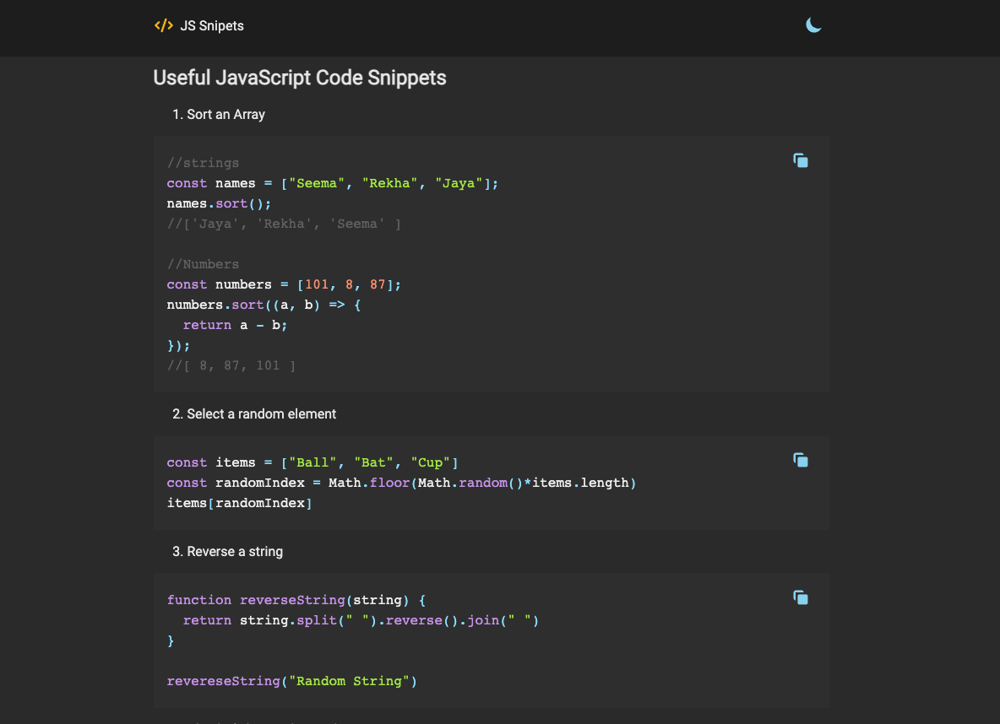

This project was bootstrapped with [Create React App](https://github.com/facebook/create-react-app).

## Available Scripts

In the project directory, you can run:

### `yarn install`

Instal All dependencies in this project

### `yarn dev`

Runs the app in the development mode. 
Open [http://localhost:3000](http://localhost:3000) to view it in the browser.

### Link

- React Syntax Highlighter: https://www.npmjs.com/package/react-syntax-highlighter
- React Copy To Clipboard: https://github.com/nkbt/react-copy-to-clipboard
- Markdown To Jsx: https://www.npmjs.com/package/markdown-to-jsx
- Heroicons: https://heroicons.com/
- article markdown: https://gist.github.com/candraKriswinarto/38e52a600edf73f3b5626acc5c07403e

### Video Tutorial

You can see my youtube video for this project in [here](https://youtu.be/Od-Uj5RSsuM)